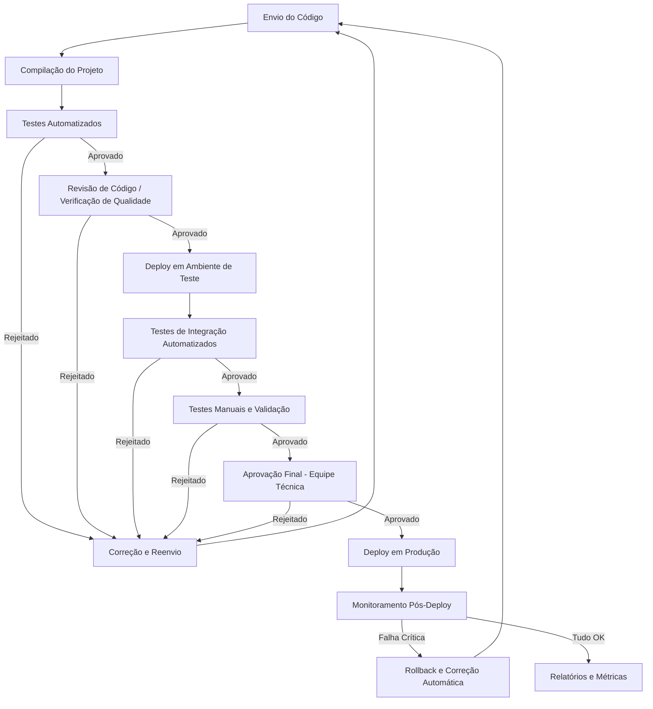

**Nome:** Ana Julia, Bianca Farias, Giovanna Silva, Lucas Carvalho e Tamiris Carvalho

```mermaid

flowchart TD
    A[Envio do Código] --> B[Compilação do Projeto]
    B --> C[Testes Automatizados]

    C -->|Aprovado| D[Revisão de Código / Verificação de Qualidade]
    C -->|Rejeitado| X[Correção e Reenvio]
    X --> A

    D -->|Aprovado| E[Deploy em Ambiente de Teste]
    D -->|Rejeitado| X

    E --> F[Testes de Integração Automatizados]
    F -->|Aprovado| G[Testes Manuais e Validação]
    F -->|Rejeitado| X

    G -->|Aprovado| H[Aprovação Final - Equipe Técnica]
    G -->|Rejeitado| X

    H -->|Aprovado| I[Deploy em Produção]
    H -->|Rejeitado| X

    I --> J[Monitoramento Pós-Deploy]
    J -->|Falha Crítica| K[Rollback e Correção Automática]
    J -->|Tudo OK| L[Relatórios e Métricas]

    K --> A

```
